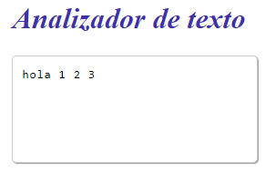
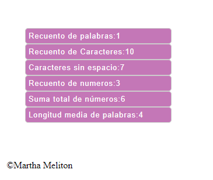

# Analizador de texto
Este proyecto es una herramienta en línea que permite contar el número de palabras en un texto. Desarrollado con HTML, CSS y JavaScript, te permite analizar y obtener métricas clave.

## Índice
* [1. Descripcion](#1-Descripcion)
* [2. Caracteristicas](#2-Caracteristicas)
* [3. Funcionalidad](#3-Funcionalidades)
* [4 .Tecnologias](#5-Tecnologias)
* [5. Deploy](#4-Deploy)
* [6 .Autor](#6-Autor)

***
## 1. Descripcion
Esta herramienta es capaz de obtener métricas importantes de cualquier texto. Con ella, puedes obtener información sobre el contenido de un texto de manera rápida y sencilla. El Analizador de Texto cuenta con las siguientes 6 métricas:
* 1.Recuento de palabras
* 2.Recuento de caracteres
* 3.Recuento de caracteres excluyendo espacios y signos de puntuación
* 4.Recuento de números
* 5.Suma total de números
* 6.Longitud media de las palabras

## 2. Caracteristicas
* Interfaz de Usuario Amigable: Ofrece una interfaz fácil de usar que permite a los usuarios ingresar texto y ver los resultados de manera clara y sencilla.
  
.png)
* Resultados Instantáneos: Proporciona resultados de métricas de manera rápida y en tiempo real a medida que se ingresa el texto.

## 3. Funcionalidades

1. La aplicación permite a la usuario ingresar un texto escribiéndolo
en un cuadro de texto.

3. Las métricas se mostrarán en pantalla, lo que te permitirá obtener información valiosa sobre el texto que ingresaste.

4. La aplicación debe calcular las siguientes métricas y actualizar el
resultado en tiempo real a medida que la usuaria escribe su texto:
* -**Recuento de palabras:** La aplicación muestra el número de palabras en el texto de entrada.
* -**Recuento de caracteres:** Cuenta el número de caracteres en el texto de entrada, incluidos espacios y signos de puntuación.
* -**Recuento de caracteres excluyendo espacios y signos de puntuación:** Cuenta el número de caracteres en el texto de entrada, excluyendo espacios y signos de puntuación.
* -**Recuento de números:** Cuenta cúantos números hay en el texto de entrada.
* -**Suma total de números:** Suma todos los números que hay en el texto de entrada.
* -**Longitud media de las palabras:** Calcula la longitud media de las palabras en el texto de entrada.

5. La aplicación permite limpiar el contenido de la caja de texto haciendo
clic en un botón.

## 4. Tecnologias utilizadas

Este proyecto fue desarrollado principalmente utilizando JavaScript, HTML y CSS. A continuación, se proporciona una distribución relativa del código:

 - **JavaScript :** La lógica principal de la herramienta de contador de palabras está implementada en JavaScript, asegurando un rendimiento eficiente y una experiencia de usuario fluida.

 - **HTML :** La estructura básica de la interfaz de usuario se crea mediante HTML, proporcionando la base para la presentación del contenido.

 - **CSS :** El estilo y diseño visual se gestionan con CSS para garantizar una presentación atractiva y una experiencia de usuario intuitiva.

La distribución del código refleja la importancia de JavaScript en el desarrollo de la funcionalidad principal, mientras que HTML y CSS contribuyen significativamente a la presentación y diseño general de la herramienta.

## 4. Deploy
En este link podras acceder a la aplicacion https://marthamims.github.io/DEV012-text-analyzer/#1-Descripcion
## 4. Autor
El proyecto fue desarrollado para el bootcam de Laboratoria-Desarrollo por Martha Irene Meliton Suarez.

